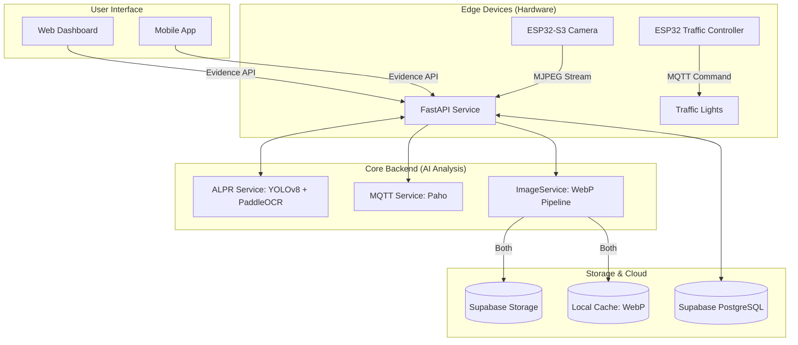
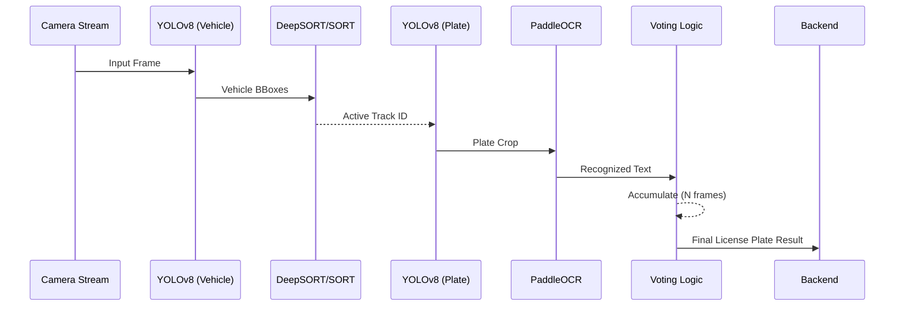
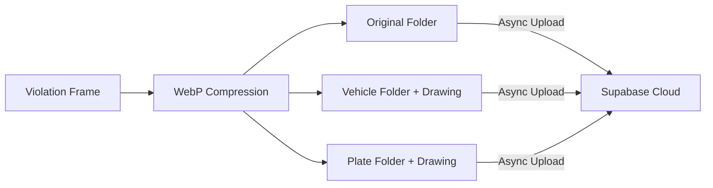
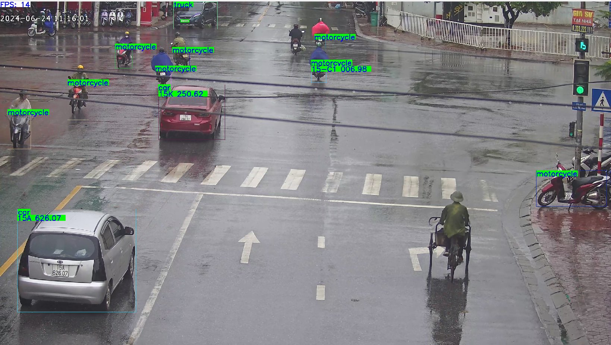

<div align="center">

# 🚦 AI-Traffic-Analysis
### Production-Grade Traffic Violation Monitoring System
**AI Analysis · IoT Integration · Real-time Surveillance**

[](https://fastapi.tiangolo.com/)
[](https://github.com/ultralytics/ultralytics)
[](https://supabase.com/)
[](https://developers.google.com/speed/webp)

---

**AI-Traffic-Analysis** is a high-performance system designed for monitoring traffic violations using advanced Computer Vision (ALPR) and IoT capabilities. It integrates ESP32-S3 cameras for real-time video streaming and ESP32 PCBs for intelligent traffic light control.

[**Explore Documentation**](docs/API_REFERENCE.md) · [**Database Schema**](docs/DATABASE.md) · [**IoT Integration**](docs/esp32-s3-devkitc-1/README.md)

</div>

## 🏗️ System Architecture



---

## 🔄 Data & Processing Flow

### 1. Unified Inference Pipeline
The system processes video frames through a high-performance, non-blocking pipeline:



### 2. Evidence Image Generation (WebP Optimized)
When a violation is detected, the `ImageService` executes a parallel storage strategy:

- **Original Image**: Full frame capture, raw and untouched for legal proof.
- **Vehicle Image**: Cropped vehicle frame with **Red BBox** and Plate Text overlay.
- **Plate Image**: High-resolution license plate crop with **Yellow Border**.



---

## 🚥 IoT Feedback Loop
The backend isn't just passive; it communicates back to the infrastructure.

1. **State Monitoring**: Backend monitors the `traffic_light_state` (Red/Yellow/Green) via MQTT or Local Settings.
2. **Violation Trigger**: If a vehicle crosses the `stop_line` during a `red` state, the detection is triggered.
3. **Control Flow**:
    - **Emergency Override**: User can trigger `emergency_red` via API.
    - **MQTT Command**: Backend publishes to `KAI/pcb/{device}/cmd`.
    - **PCB Action**: ESP32 Traffic Controller switches relays/GPIOs instantly.

---

## 📸 Demo result


## 🔥 Key Features

- 🏎️ **Core ALPR Pipeline**: Real-time Vehicle Detection (YOLOv8) & License Plate Recognition (PaddleOCR) with DeepSORT tracking.
- ⚡ **Non-Blocking Backend**: Built with high-performance FastAPI and asynchronous processing to ensure 0-latency stream handling.
- 🖼️ **Evidence Logic**: Automatically generates 3 types of evidence (Original, Vehicle Crop, Plate Crop) in optimized **WebP** format.
- ☁️ **Hybrid Storage**: Simultaneous persistence to Local Disk and **Supabase Cloud Storage** for 100% data reliability.
- 🚥 **IoT & MQTT Control**: Direct control of traffic light controllers (ESP32) and telemetry sync with ThingsBoard.
- 📱 **Universal API**: Standardized endpoints for Web Dashboards, Mobile Apps, and 3rd-party integrations.

---

## 🛠️ Technology Stack

| Layer | Technology |
|---|---|
| **Backend** | Python 3.10+, FastAPI, Uvicorn |
| **Detection** | Ultralytics YOLOv8 (Vehicle + Plate) |
| **Recognition** | PaddleOCR (PP-OCRv4) |
| **Database** | PostgreSQL via Supabase |
| **Storage** | Supabase Storage + Local WebP Cache |
| **IoT/Comms** | Paho MQTT, ThingsBoard |
| **Device Hub** | ESP32-S3 (Camera), ESP32 (Traffic Controller) |

---

## 🚀 Quick Start

### 1. Installation
Clone the repo and install all dependencies:
```bash
bash scripts/install.sh
```

### 2. Configuration
Copy the example environment file and update your credentials:
```bash
cp .env.example .env
```
Check `data/app_settings.json` for fine-grained control over camera zones and ALPR thresholds.

### 3. Launch the Backend
```bash
uvicorn api.app:app --host 0.0.0.0 --port 8000 --reload
```
View the interactive API docs at: `http://localhost:8000/docs`

---

## 📖 Documentation Index

| Topic | Description | Link |
|---|---|---|
| **API Reference** | Full 60+ endpoint documentation with examples. | [**API_REFERENCE.md**](docs/API_REFERENCE.md) |
| **Evidence Logic** | Detail on the 3 types of images: Original, Vehicle, and Plate. | [**EVIDENCE_API.md**](docs/EVIDENCE_API.md) |
| **Database Schema** | Detailed table structure, views, and RLS policies. | [**DATABASE.md**](docs/DATABASE.md) |
| **Supabase Setup** | Guide for configuring DB and Storage. | [**supabase_config.md**](docs/supabase_config.md) |
| **Mobile Integration** | Architecture for mobile app development. | [**MOBILE_APP.md**](docs/MOBILE_APP.md) |

---

## 📂 Project Structure
```text
AI-Traffic-Analysis/
├── api/                # FastAPI Application (Routes, Services, Schemas)
├── data/               # Local settings, weights, and caches
├── database/           # SQL migration scripts
├── detectors/          # Core ALPR inference logic (YOLO, PaddleOCR)
├── docs/               # Technical Documentation ⬅️ START HERE
├── esp32-s3-devkitc-1/ # ESP32-S3 Camera Firmware
└── ESP32_pcb/          # Traffic Light Controller Firmware
```

---

<div align="center">
Developed with ❤️ for Smart City Surveillance.
</div>
